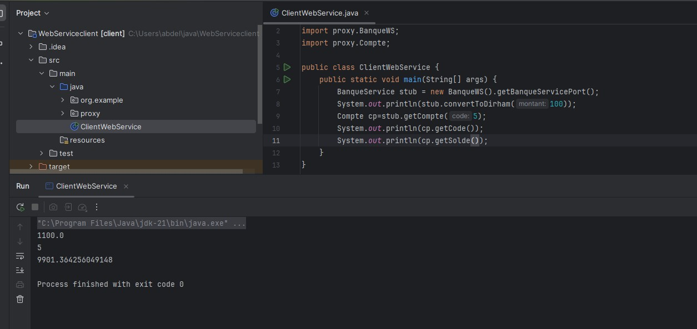
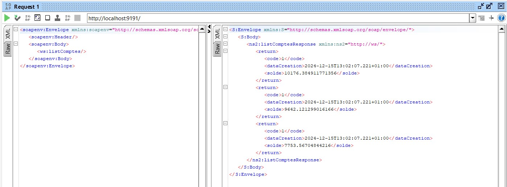

# Web-Service-Sop-Wsdl

This project demonstrates the implementation of a SOAP-based web service with WSDL. It includes a server application and a client application for interacting with the web service. The project provides operations for currency conversion, retrieving account details, and listing accounts.

## Screenshots

### Running the Server

### WSDL File

### Convert to Dirham (Server)

### Convert to Dirham (Client)

### Get Account Details

### Get Account Balance (Client)

### List of Accounts

### Project Demo

